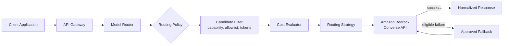

# aws-model-router

A serverless, policy-driven **model routing platform** on AWS. Applications never call a
foundation model directly — they send inference requests to a centralized Model Router,
which decides which approved model handles each request based on configurable policy:
capabilities, application identity, data classification, allowlists, estimated cost,
latency preference, quality tier, model health, regional availability, token limits,
fallback configuration, experimentation, and governance requirements.

The initial provider is **Amazon Bedrock**. The architecture is deliberately
provider-independent so a second provider could be added later through an adapter,
without changing the routing domain.

> **Status: Phase 2 — Domain model and local routing engine.** The routing engine —
> domain models, policy/catalogue schemas, candidate filtering, and three deterministic
> routing strategies — runs entirely locally, with zero AWS credentials, via
> `scripts/evaluate_route.py` (see [below](#try-it-locally)). No AWS infrastructure is
> deployed and no model is invoked yet. See [`PROJECT_PLAN.md`](PROJECT_PLAN.md) for the
> full phased roadmap.

This is not a chatbot UI and not a tutorial wrapper around a single Lambda function. It
is built as a production-shaped AWS reference implementation, emphasizing architecture,
cost control, reliability, observability, security, testability, infrastructure as code,
and operational maturity.

## Why a model router?

Without one, every application that needs an LLM re-implements model selection, cost
limits, retries, and fallback — and each does it slightly differently. Centralizing this
means:

* Model allowlists, cost ceilings, and quality tiers are enforced in **one place**, not
  reimplemented per application.
* Swapping or upgrading a model, or adding a second provider, is a **configuration and
  adapter change**, not an N-application migration.
* Every application gets consistent **observability, audit, and cost telemetry** for
  free.

See [`docs/adr/0001-centralized-model-routing.md`](docs/adr/0001-centralized-model-routing.md)
for the full rationale.

## How routing works, at a glance



A client sends a normalized request (application ID, messages, requested capability,
optional cost/latency/quality constraints). The router resolves that application's
policy, filters eligible models, estimates cost, selects a route, invokes it, and —
only for a defined set of eligible failures — falls back to an approved alternative.
Every decision carries stable, machine-readable reason codes
(e.g. `CAPABILITY_MATCH`, `WITHIN_COST_LIMIT`, `FALLBACK_SELECTED`) so it can be
explained without exposing internal configuration or secrets.

Full architecture, all four diagrams (component, request sequence, fallback sequence,
trust boundary), and the components involved:
[`docs/architecture/overview.md`](docs/architecture/overview.md).

## API surface (target contract)

| Method | Path | Purpose |
|---|---|---|
| `POST` | `/v1/inference` | Route and execute an inference request |
| `POST` | `/v1/routes/evaluate` | Explain the route that would be selected, without invoking a model |
| `GET` | `/v1/models` | List logical capabilities and service tiers available to the caller |
| `GET` | `/v1/decisions/{decisionId}` | Retrieve a sanitized, previously recorded routing decision |
| `GET` | `/health` | Process liveness |
| `GET` | `/ready` | Configuration readiness |

Full request/response examples and error taxonomy:
[`docs/architecture/api-contracts.md`](docs/architecture/api-contracts.md).

## Requirements

Functional and non-functional requirements are tracked in
[`docs/requirements.md`](docs/requirements.md), including cost, security, reliability,
observability, testability, extensibility, and determinism requirements.

## Domain model

Typed domain concepts (`InferenceRequest`, `RoutingPolicy`, `ModelDefinition`,
`RoutingDecision`, reason codes, etc.) and the core interfaces they're built around are
defined in [`docs/architecture/domain-glossary.md`](docs/architecture/domain-glossary.md)
and implemented as immutable, `mypy --strict`-typed Pydantic models under
[`src/domain/`](src/domain/), with zero AWS SDK imports (ADR-002).

## Try it locally

Evaluate a routing decision without any AWS credentials, using the sample policies and
model catalogue under [`policies/`](policies/):

```bash
pip install -e ".[dev]"
python scripts/evaluate_route.py --request scripts/examples/support_assistant_balanced.json
```

This resolves the calling application's policy, filters the model catalogue by
capability/allowlist/quality-tier/token/cost, and prints a fully-explained
`RoutingDecision` — the same decision `POST /v1/routes/evaluate` will return once the
HTTP API exists (Phase 5). See [`scripts/examples/`](scripts/examples/) for more
scenarios (cost-limit rejection, policy fallback, capability not permitted).

## Architecture decisions

Significant, hard-to-reverse decisions are recorded as ADRs in [`docs/adr/`](docs/adr/):

| ADR | Decision |
|---|---|
| [001](docs/adr/0001-centralized-model-routing.md) | Centralized model routing |
| [002](docs/adr/0002-provider-independent-domain-architecture.md) | Provider-independent domain architecture |
| [003](docs/adr/0003-amazon-bedrock-as-initial-provider.md) | Amazon Bedrock as initial provider |
| [004](docs/adr/0004-aws-cdk-with-python.md) | AWS CDK with Python |
| [005](docs/adr/0005-serverless-pay-per-request-architecture.md) | Serverless, pay-per-request architecture |
| [006](docs/adr/0006-model-aliases-instead-of-client-supplied-model-ids.md) | Model aliases instead of client-supplied model IDs |
| [007](docs/adr/0007-deterministic-explainable-routing.md) | Deterministic, explainable routing |
| [008](docs/adr/0008-metadata-only-audit-records-by-default.md) | Metadata-only audit records by default |
| [009](docs/adr/0009-converse-api-as-normalized-bedrock-interface.md) | Converse API as the normalized Bedrock interface |
| [010](docs/adr/0010-configuration-storage-approach.md) | Configuration storage approach |

## Repository structure

```
.
├── .github/                 # PR/issue templates, CI/CD workflows (from Phase 8)
├── docs/
│   ├── adr/                 # Architecture Decision Records
│   ├── architecture/        # Overview, diagrams, API contracts, domain glossary
│   ├── operations/          # Runbooks, alarm response (from Phase 6)
│   ├── security/            # Threat model, security architecture (from Phase 7)
│   └── cost/                # Cost estimation & pricing-update guides (from Phase 6)
├── events/                  # Sample API events for local Lambda invocation (from Phase 5)
├── infrastructure/          # AWS CDK v2 (Python) app (from Phase 5)
│   ├── app.py
│   ├── cdk.json
│   ├── stacks/
│   ├── constructs/
│   └── tests/
├── policies/                # Version-controlled routing policy & model catalogue configuration
├── scripts/                 # evaluate_route.py (local CLI) + example requests
├── src/
│   ├── domain/               # Pure Python domain models, routing strategies, reason codes
│   ├── application/          # Orchestration: validation → policy → filter → cost → strategy → invoke
│   ├── adapters/              # BedrockModelProvider, DynamoDB/SSM-backed repositories, metrics
│   ├── handlers/              # Thin AWS Lambda entry points
│   └── shared/                 # Cross-cutting utilities (Clock, IdentifierGenerator, etc.)
├── tests/
│   ├── contract/             # Provider/API contract tests
│   ├── integration/           # Multi-component, in-process tests
│   └── unit/                  # Fast, isolated tests
├── pyproject.toml
├── Makefile
├── PROJECT_PLAN.md          # Living phased delivery plan — read this first if resuming cold
├── README.md
├── CONTRIBUTING.md
├── SECURITY.md
└── LICENSE
```

Architectural boundaries this structure exists to protect: `src/domain/` never imports
`boto3` or any AWS SDK; AWS integration always sits behind `src/adapters/`; Lambda
handlers in `src/handlers/` stay thin. See [`CONTRIBUTING.md`](CONTRIBUTING.md) for the
full rule set.

## Local development setup

Requires **Python 3.12**. AWS credentials are **not** required for anything in Phase 1–4
(domain logic, routing engine, Bedrock adapter tests all use fakes/stubs).

```bash
# Create and activate a virtual environment
python -m venv .venv
# macOS/Linux:
source .venv/bin/activate
# Windows (PowerShell):
.venv\Scripts\Activate.ps1

# Install runtime + development dependencies
pip install -e ".[dev]"

# Install git hooks
pre-commit install
```

Day-to-day commands (see [`Makefile`](Makefile) for the full list; run these directly if
`make` isn't available on your system, e.g. plain Windows PowerShell without Git Bash/WSL):

```bash
make lint            # ruff check .
make format           # black .
make format-check     # black --check .
make typecheck        # mypy
make test             # pytest
make test-cov         # pytest --cov --cov-report=term-missing
make ci               # format-check + lint + typecheck + test — run this before every PR
```

PowerShell equivalents if you don't have `make` installed:

```powershell
ruff check .
black --check .
mypy
pytest
```

## Coding standards (summary)

* Python 3.12, fully type-hinted, `mypy --strict`.
* Black + Ruff enforced locally (pre-commit) and in CI (Phase 8).
* UTC, timezone-aware timestamps only (no naive `datetime`).
* `Decimal` for all monetary calculations — never `float`.
* Immutable domain objects where practical; dependency inversion between layers.
* No hardcoded model pricing/IDs in business logic; no logging of raw prompts/responses.

Full detail and contribution workflow: [`CONTRIBUTING.md`](CONTRIBUTING.md).
Security policy and vulnerability reporting: [`SECURITY.md`](SECURITY.md).

## Roadmap

Development proceeds in explicit, independently-reviewable phases — see
[`PROJECT_PLAN.md`](PROJECT_PLAN.md) for full Definitions of Done:

| Phase | Focus |
|---|---|
| 1 | Foundation and architecture |
| 2 | Domain model and local routing engine (no AWS) *(this phase)* |
| 3 | Bedrock provider adapter (fakes/Stubber in tests, opt-in smoke test) |
| 4 | Fallback, experimentation, and idempotency |
| 5 | AWS CDK infrastructure and serverless API |
| 6 | Observability, auditability, and cost governance |
| 7 | Security and resilience hardening |
| 8 | CI/CD with GitHub Actions (OIDC, no static AWS keys) |
| 9 | Performance, load testing, and portfolio polish |
| 10 | Advanced extensions *(optional, explicit request only)* |

## What this project deliberately does not do

* No client-supplied provider model IDs — only server-resolved logical capabilities
  ([ADR-006](docs/adr/0006-model-aliases-instead-of-client-supplied-model-ids.md)).
* No opaque, ML-based routing in the base implementation — routing is deterministic and
  explainable ([ADR-007](docs/adr/0007-deterministic-explainable-routing.md)).
* No raw prompt/response persistence by default
  ([ADR-008](docs/adr/0008-metadata-only-audit-records-by-default.md)).
* No always-on compute, NAT Gateway, or provisioned Bedrock throughput in the base
  deployment ([ADR-005](docs/adr/0005-serverless-pay-per-request-architecture.md)).
* No claim that estimated cost equals AWS billed cost, and no claim that routing alone
  provides AI safety/content governance (addressed explicitly in Phase 7).

## License

[MIT](LICENSE).
