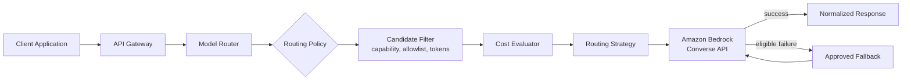

# aws-model-router

A serverless, policy-driven **model routing platform** on AWS. Applications never call a
foundation model directly — they send inference requests to a centralized Model Router,
which decides which approved model handles each request based on configurable policy:
capabilities, application identity, data classification, allowlists, estimated cost,
latency preference, quality tier, model health, regional availability, token limits,
fallback configuration, experimentation, and governance requirements.

The initial provider is **Amazon Bedrock**. The architecture is deliberately
provider-independent so a second provider could be added later through an adapter,
without changing the routing domain.

> **Status: Phase 8 — CI/CD with GitHub Actions.** GitHub OIDC (no static AWS keys) via
> a dedicated, least-privilege bootstrap stack; a PR workflow (lint, typecheck, tests,
> CDK assertion tests, cdk-nag + cfn-lint IaC scanning, dependency and secret scanning)
> with zero AWS credentials — a fork PR gets identical treatment, by construction, not
> configuration; a deployment workflow (auto dev, manually-approved prod). Adding
> cfn-lint caught a genuine, previously-latent bug: a CloudFormation resource type
> (`AWS::CloudWatch::Dashboard`) doesn't yet accept the `Tags` property CDK's tagging
> aspect was applying to it. See [`PROJECT_PLAN.md`](PROJECT_PLAN.md) for the full
> phased roadmap.

This is not a chatbot UI and not a tutorial wrapper around a single Lambda function. It
is built as a production-shaped AWS reference implementation, emphasizing architecture,
cost control, reliability, observability, security, testability, infrastructure as code,
and operational maturity.

## Why a model router?

Without one, every application that needs an LLM re-implements model selection, cost
limits, retries, and fallback — and each does it slightly differently. Centralizing this
means:

* Model allowlists, cost ceilings, and quality tiers are enforced in **one place**, not
  reimplemented per application.
* Swapping or upgrading a model, or adding a second provider, is a **configuration and
  adapter change**, not an N-application migration.
* Every application gets consistent **observability, audit, and cost telemetry** for
  free.

See [`docs/adr/0001-centralized-model-routing.md`](docs/adr/0001-centralized-model-routing.md)
for the full rationale.

## How routing works, at a glance



A client sends a normalized request (application ID, messages, requested capability,
optional cost/latency/quality constraints). The router resolves that application's
policy, filters eligible models, estimates cost, selects a route, invokes it, and —
only for a defined set of eligible failures — falls back to an approved alternative.
Every decision carries stable, machine-readable reason codes
(e.g. `CAPABILITY_MATCH`, `WITHIN_COST_LIMIT`, `FALLBACK_SELECTED`) so it can be
explained without exposing internal configuration or secrets.

Full architecture, all four diagrams (component, request sequence, fallback sequence,
trust boundary), and the components involved:
[`docs/architecture/overview.md`](docs/architecture/overview.md).

## API surface

| Method | Path | Purpose |
|---|---|---|
| `POST` | `/v1/inference` | Route and execute an inference request |
| `POST` | `/v1/routes/evaluate` | Explain the route that would be selected, without invoking a model |
| `GET` | `/v1/models` | List logical capabilities and service tiers available to the caller |
| `GET` | `/v1/decisions/{decisionId}` | Retrieve a sanitized, previously recorded routing decision |
| `GET` | `/health` | Process liveness |
| `GET` | `/ready` | Configuration readiness |

Full request/response examples and error taxonomy:
[`docs/architecture/api-contracts.md`](docs/architecture/api-contracts.md).

## Requirements

Functional and non-functional requirements are tracked in
[`docs/requirements.md`](docs/requirements.md), including cost, security, reliability,
observability, testability, extensibility, and determinism requirements.

## Domain model

Typed domain concepts (`InferenceRequest`, `RoutingPolicy`, `ModelDefinition`,
`RoutingDecision`, reason codes, etc.) and the core interfaces they're built around are
defined in [`docs/architecture/domain-glossary.md`](docs/architecture/domain-glossary.md)
and implemented as immutable, `mypy --strict`-typed Pydantic models under
[`src/domain/`](src/domain/), with zero AWS SDK imports (ADR-002).

## Bedrock provider adapter

`BedrockModelProvider` (under [`src/adapters/bedrock/`](src/adapters/bedrock/))
implements `domain.ports.ModelProvider` against the Bedrock Converse API (ADR-009): it
resolves a logical model alias through the catalogue (never a client-supplied model
ID — ADR-006), validates the request against that model's declared capabilities,
invokes it, and classifies any failure into a stable
`throttled | transient | timeout | permanent` taxonomy with bounded, full-jitter
exponential-backoff retries. Every test exercises this against a hand-rolled fake client
or a real boto3 client wrapped in `botocore.stub.Stubber` — no test makes a live AWS
call. A real invocation is available only via the explicitly opt-in
[`scripts/bedrock_live_smoke_test.py`](scripts/bedrock_live_smoke_test.py) (env-flag +
`--confirm-cost` gated, never run by CI).

## Fallback, experimentation, and idempotency

`application.invocation_orchestrator.InvocationOrchestrator` (under
[`src/application/`](src/application/)) composes route evaluation and Bedrock
invocation into the full request flow:

* **Fallback** (ADR-011) is policy-controlled: `RoutingPolicy.fallback_policy` configures
  an ordered chain of alternate models and a maximum chain length. Fallback is attempted
  only for throttled/transient/timeout invocation failures — never for policy denial,
  cost rejection, unsupported capability, or malformed configuration, all of which are
  resolved (or raised) before any invocation is attempted.
* **Weighted experimentation** (ADR-012) adds `ExperimentStrategy`, a fourth
  `RoutingStrategy` alongside Phase 2's preferred-model/lowest-cost/quality-tier: cohort
  assignment is a deterministic SHA-256 hash of a stable subject key, proportional to
  configured arm weights — no randomness, fully reproducible.
* **Idempotency** (ADR-013) dedupes concurrent duplicate requests unconditionally (a
  real `threading`-based test proves this — not mocked), while replaying a *completed*
  result to a later, non-overlapping duplicate is a separate, explicit
  `allow_response_caching` policy opt-in (off by default, per ADR-008).
* **Retry/cost-amplification controls** (ADR-014): the worst-case cost multiplier for
  one logical request is a fixed, computable
  `FallbackPolicy.maximum_attempts × RetryPolicy.max_attempts` — not an open-ended loop.

Reference implementations (`adapters.memory`) provide thread-safe, single-process
`IdempotencyStore` and `RoutingDecisionRepository` for local development and tests.
DynamoDB-backed, multi-instance-safe implementations of the same protocols (below) are
what a deployed Lambda actually uses.

## AWS CDK infrastructure and serverless API

[`infrastructure/`](infrastructure/) (AWS CDK v2, Python — ADR-004) provisions
`ModelRouterStack`: one API Gateway REST API, one shared Lambda function behind all six
routes (ADR-016), and two DynamoDB tables.

* **Authorization** (ADR-015): `/health`/`/ready` are public; every `/v1/*` route
  requires IAM (SigV4) authorization. Fine-grained per-application authorization
  (allowlists, cost limits) is then enforced by the router's own policy engine.
* **Lambda packaging** (ADR-017): a stable `Code.from_asset(..., bundling=...)`, not the
  experimental `aws_lambda_python_alpha` construct. Bundling tries a Docker-free local
  `pip install --platform manylinux2014_x86_64` path first (works even with no local
  Docker daemon) and falls back to Docker-based bundling automatically.
* **Storage** (ADR-018): a `DecisionsTable` (backs `GET /v1/decisions/{decisionId}`) and
  an `IdempotencyTable`, both on-demand billing, AWS-managed encryption, TTL-based
  expiry, and an environment-driven removal policy/point-in-time-recovery setting (`dev`:
  `DESTROY`/no PITR; `prod`: `RETAIN`/PITR on).
* Least-privilege IAM: the Lambda's Bedrock permissions are scoped to exactly the
  catalogued models' ARNs (never `resources=["*"]`), computed at synth time from
  `policies/model_catalogue.yaml`.
* CDK template-assertion tests (`tests/infra/`, `pytest.mark.infra`) verify encryption,
  retention, removal policy, IAM scoping, and endpoint authorization against the real
  synthesized CloudFormation template — excluded from the default `pytest` run (real
  asset bundling takes tens of seconds); run explicitly with `pytest -m infra`.

See [`docs/operations/deployment-and-teardown.md`](docs/operations/deployment-and-teardown.md)
for `cdk deploy`/`cdk destroy` usage and what `RemovalPolicy.RETAIN` means for `prod`.

## Observability, auditability, and cost governance

* **Structured logging** (ADR-019): `src/shared/structured_logging.py`'s `JsonFormatter`
  emits one JSON object per log line, with a fixed, documented whitelist of safe
  attributes (`request_id`, `decision_id`, `application_id`, `capability`, `model_alias`,
  `error_code`, `latency_ms`, ...) — never raw prompt/response content (ADR-008
  unchanged).
* **Custom metrics via CloudWatch Embedded Metric Format** (ADR-019):
  `adapters.metrics.EmfMetricsPublisher` writes one EMF JSON line per metric point —
  `RequestCount`, `FallbackUsedCount`, `NoEligibleModelCount`, `EstimatedCostUsd`,
  `InvocationAttemptCount`, `InvocationLatencyMs`, `ProviderFailureCount` — auto-extracted
  by CloudWatch with **no extra `PutMetricData` API call and no new IAM permission**.
  Every metric declares exactly one CloudWatch dimension (`Environment`); per-model/
  per-capability breakdowns go through CloudWatch Logs Insights instead (see
  [`docs/operations/observability.md`](docs/operations/observability.md) for why).
* **Model health signal** (ADR-020): `ModelHealthRepository` derives a per-model
  `HEALTHY`/`DEGRADED`/`UNAVAILABLE` status from a consecutive-failure counter —
  `InvocationOrchestrator` records every attempt's outcome, and candidate filtering
  (`domain/filtering.py`) excludes `UNAVAILABLE` models (`MODEL_UNHEALTHY`) while
  flagging `DEGRADED` ones informationally (`MODEL_DEGRADED`) without excluding them.
  The in-memory reference implementation is process-local by design — see ADR-020 for
  why that's an acceptable trade-off here, unlike idempotency.
* **Dashboard and alarms** (ADR-021): `ObservabilityConstruct` provisions a CloudWatch
  dashboard and 7 alarms (Lambda errors/throttles, API 5xx, provider failure, fallback
  rate, no-eligible-model, estimated-spend guidance), all notifying one SNS topic —
  subscribe your own endpoint post-deploy (`docs/operations/runbook.md`); no
  placeholder/fabricated endpoint is created for you.

Full guides: [`docs/operations/observability.md`](docs/operations/observability.md)
(logs/metrics/dashboard reference), [`docs/operations/alarm-response.md`](docs/operations/alarm-response.md)
(what to do when an alarm fires), [`docs/operations/runbook.md`](docs/operations/runbook.md)
(routine operational tasks), and [`docs/cost/cost-estimation-guide.md`](docs/cost/cost-estimation-guide.md)
(the estimate-vs-billing gap, pricing updates, retry/fallback cost multiplication).

## Security and resilience hardening

* **Threat model** ([`docs/security/threat-model.md`](docs/security/threat-model.md)):
  22 threats across the 5 trust boundaries plus AI content safety, each with a
  mitigation, residual risk, and status. The one significant open finding — a caller
  can claim any `applicationId` in the request body, since IAM proves identity, not a
  binding to a specific application (ADR-015) — now has a real detective control
  (`caller_principal_arn` logged on every request) and a scoped, documented design for
  the preventive fix.
* **Least-privilege IAM review** ([ADR-022](docs/adr/0022-least-privilege-iam-review.md)):
  found and fixed a real over-grant — `grant_read_write_data()` had granted
  `Scan`/`Query`/`BatchWriteItem`/etc. that neither DynamoDB adapter ever calls, now
  replaced with explicit, minimal per-table action grants, verified by a CDK assertion
  test.
* **Cross-Region inference profile resilience**
  ([ADR-023](docs/adr/0023-cross-region-inference-profile-resilience.md)): evaluated,
  not adopted by default — including a documented IAM gap (the underlying per-Region
  foundation-model ARNs aren't currently granted) that would need closing first.
* **Responsible AI Gateway placement**
  ([ADR-024](docs/adr/0024-responsible-ai-gateway-placement.md)): recommends
  integrating Amazon Bedrock Guardrails into the same Bedrock invocation this router
  already makes, rather than a separate gateway component — grounded in verified facts
  about Guardrails (no project named exactly "aws-responsible-ai-gateway" exists).
  Routing remains deterministic and explainable (ADR-007); it provides no content-safety
  guarantee on its own.
* **Abuse-case tests** (`tests/unit/handlers/test_abuse_cases.py`): unrecognized-field
  smuggling has zero effect on routing, raw prompt/response content never appears in
  logs or persisted audit records, and adversarial decision-ID lookups never 500.

Full guides: [`docs/security/security-architecture.md`](docs/security/security-architecture.md)
(layer-by-layer walkthrough), [`docs/security/resilience-test-plan.md`](docs/security/resilience-test-plan.md)
(what's tested vs. deferred to Phase 9), [`docs/operations/incident-response.md`](docs/operations/incident-response.md),
and [`docs/operations/disaster-recovery.md`](docs/operations/disaster-recovery.md).

## CI/CD

* **GitHub OIDC, no static AWS keys** ([ADR-025](docs/adr/0025-github-oidc-deploy-role-design.md)):
  `infrastructure/stacks/github_oidc_stack.py` — deployed manually, once, by a human —
  creates the OIDC trust and two per-environment deploy roles. Each role grants only
  `sts:AssumeRole` on the three roles `cdk bootstrap` itself already created; the actual
  resource-creation permissions stay on that separately-governable bootstrap role, not
  duplicated onto the GitHub-trusted role.
* **PR and deployment are separate workflows, by construction**
  ([ADR-026](docs/adr/0026-pr-and-deploy-workflow-separation.md)): `pr.yml` (every pull
  request, including forks) requests no `id-token` permission and touches no AWS
  credential anywhere in the file — there's nothing for a fork PR to exploit, no
  configuration to get right. `deploy.yml` triggers only on a push to `main`, deploying
  `dev` automatically and `prod` only after a human approves the `prod` GitHub
  Environment's required-reviewers protection rule.
* **IaC security scanning: cdk-nag + cfn-lint**
  ([ADR-027](docs/adr/0027-iac-security-scanning-approach.md)): `cdk-nag`'s
  `AwsSolutionsChecks` runs as a gated CDK Aspect (`CDK_NAG_ENABLED=true`); every
  finding is fixed (a real `RequestValidator` was added for API Gateway request
  validation) or suppressed with a written, ADR-linked justification — never a blanket
  bypass. cfn-lint, run separately against the synthesized templates, caught a genuine
  bug cdk-nag didn't: `AWS::CloudWatch::Dashboard` doesn't yet support the `Tags`
  property CDK's tagging aspect was applying to it — a real, previously-latent
  deployment-breaking defect, fixed by excluding that resource type from tagging.
* Also in `pr.yml`: `pip-audit` (dependency vulnerability scanning) and `gitleaks`
  (secret scanning), both required checks, not advisory-only.

Full guide, including one-time manual setup (OIDC bootstrap, GitHub Environments,
branch protection) and rollback guidance:
[`docs/operations/ci-cd.md`](docs/operations/ci-cd.md).

## Try it locally

Evaluate a routing decision without any AWS credentials, using the sample policies and
model catalogue under [`policies/`](policies/):

```bash
pip install -e ".[dev]"
python scripts/evaluate_route.py --request scripts/examples/support_assistant_balanced.json
```

This resolves the calling application's policy, filters the model catalogue by
capability/allowlist/quality-tier/token/cost, and prints a fully-explained
`RoutingDecision` — the same decision `POST /v1/routes/evaluate` returns over HTTP. See
[`scripts/examples/`](scripts/examples/) for more scenarios (cost-limit rejection, policy
fallback, capability not permitted).

To exercise the real Lambda handler code end to end — request parsing, routing, error
mapping, response serialization — without deploying anything:

```bash
python scripts/invoke_lambda_locally.py --method POST --resource /v1/inference \
    --body events/support_assistant_balanced.json
```

See [`scripts/invoke_lambda_locally.py`](scripts/invoke_lambda_locally.py)'s docstring
for real-services mode (against a deployed stack).

## Architecture decisions

Significant, hard-to-reverse decisions are recorded as ADRs in [`docs/adr/`](docs/adr/):

| ADR | Decision |
|---|---|
| [001](docs/adr/0001-centralized-model-routing.md) | Centralized model routing |
| [002](docs/adr/0002-provider-independent-domain-architecture.md) | Provider-independent domain architecture |
| [003](docs/adr/0003-amazon-bedrock-as-initial-provider.md) | Amazon Bedrock as initial provider |
| [004](docs/adr/0004-aws-cdk-with-python.md) | AWS CDK with Python |
| [005](docs/adr/0005-serverless-pay-per-request-architecture.md) | Serverless, pay-per-request architecture |
| [006](docs/adr/0006-model-aliases-instead-of-client-supplied-model-ids.md) | Model aliases instead of client-supplied model IDs |
| [007](docs/adr/0007-deterministic-explainable-routing.md) | Deterministic, explainable routing |
| [008](docs/adr/0008-metadata-only-audit-records-by-default.md) | Metadata-only audit records by default |
| [009](docs/adr/0009-converse-api-as-normalized-bedrock-interface.md) | Converse API as the normalized Bedrock interface |
| [010](docs/adr/0010-configuration-storage-approach.md) | Configuration storage approach |
| [011](docs/adr/0011-fallback-eligibility.md) | Fallback eligibility |
| [012](docs/adr/0012-deterministic-experimentation.md) | Deterministic experimentation |
| [013](docs/adr/0013-idempotency-strategy.md) | Idempotency strategy |
| [014](docs/adr/0014-retry-and-cost-amplification-controls.md) | Retry and cost-amplification controls |
| [015](docs/adr/0015-api-authorization-model.md) | API authorization model (IAM) |
| [016](docs/adr/0016-single-shared-lambda-handler.md) | Single shared Lambda handler |
| [017](docs/adr/0017-lambda-packaging-without-experimental-cdk-constructs.md) | Lambda packaging without experimental CDK constructs |
| [018](docs/adr/0018-dynamodb-decision-and-idempotency-store-design.md) | DynamoDB decision and idempotency store design |
| [019](docs/adr/0019-observability-approach.md) | Observability approach — structured logging and EMF custom metrics |
| [020](docs/adr/0020-model-health-signal-scope.md) | Model health signal — scope and derivation |
| [021](docs/adr/0021-alerting-design.md) | Alerting design — CloudWatch alarms and a single SNS topic |
| [022](docs/adr/0022-least-privilege-iam-review.md) | Least-privilege IAM review |
| [023](docs/adr/0023-cross-region-inference-profile-resilience.md) | Cross-Region inference profile resilience evaluation |
| [024](docs/adr/0024-responsible-ai-gateway-placement.md) | Responsible AI Gateway placement |
| [025](docs/adr/0025-github-oidc-deploy-role-design.md) | GitHub OIDC deploy role design |
| [026](docs/adr/0026-pr-and-deploy-workflow-separation.md) | PR and deployment workflow separation |
| [027](docs/adr/0027-iac-security-scanning-approach.md) | IaC security scanning — cdk-nag and cfn-lint |

## Repository structure

```
.
├── .github/
│   ├── workflows/            # pr.yml, deploy.yml, pricing-freshness-reminder.yml
│   ├── dependabot.yml
│   ├── ISSUE_TEMPLATE/
│   └── PULL_REQUEST_TEMPLATE.md
├── docs/
│   ├── adr/                 # Architecture Decision Records
│   ├── architecture/        # Overview, diagrams, API contracts, domain glossary
│   ├── operations/          # Deployment/teardown, observability, alarm-response, runbook,
│   │                        # incident-response, disaster-recovery, ci-cd
│   ├── security/            # Threat model, security architecture, resilience test plan
│   └── cost/                # Cost estimation & pricing-update guide
├── events/                  # Sample HTTP-shape request bodies for invoke_lambda_locally.py
├── infrastructure/          # AWS CDK v2 (Python) app
│   ├── app.py
│   ├── cdk.json
│   ├── config.py
│   ├── bundling.py
│   ├── stacks/               # model_router_stack.py, github_oidc_stack.py
│   └── cdk_constructs/       # storage (DynamoDB), lambda, api gateway, observability constructs
├── policies/                # Version-controlled routing policy & model catalogue configuration
├── scripts/                 # evaluate_route.py, invoke_lambda_locally.py, bedrock_live_smoke_test.py
├── src/
│   ├── domain/               # Pure Python domain models, routing strategies, reason codes
│   ├── application/          # Orchestration: validation → policy → filter → cost → strategy → invoke
│   ├── adapters/              # BedrockModelProvider, DynamoDB repositories, in-memory health, EMF metrics
│   ├── handlers/              # Thin AWS Lambda entry point (api_handler.py)
│   └── shared/                 # Clock, IdentifierGenerator, structured JSON logging
├── tests/
│   ├── contract/             # Provider/API contract tests
│   ├── infra/                 # CDK template-assertion tests (pytest.mark.infra, opt-in)
│   ├── integration/           # Multi-component, in-process tests
│   └── unit/                  # Fast, isolated tests
├── pyproject.toml
├── Makefile
├── PROJECT_PLAN.md          # Living phased delivery plan — read this first if resuming cold
├── README.md
├── CONTRIBUTING.md
├── SECURITY.md
└── LICENSE
```

Architectural boundaries this structure exists to protect: `src/domain/` never imports
`boto3` or any AWS SDK; AWS integration always sits behind `src/adapters/`; Lambda
handlers in `src/handlers/` stay thin. See [`CONTRIBUTING.md`](CONTRIBUTING.md) for the
full rule set.

## Local development setup

Requires **Python 3.12**, plus **Node.js** (any current LTS) if you'll touch
`infrastructure/` or run `pytest -m infra` — `aws-cdk-lib`'s jsii bridge runs on Node
under the hood even when only calling its Python API (`Template.from_stack(...)`), not
just for the `cdk` CLI itself. AWS credentials are **not** required for the domain
logic, routing engine, Bedrock adapter tests, Lambda handler tests, CDK assertion tests
(`pytest -m infra` synthesizes against a fixed, fake account/Region), or fake-mode local
invocation (`scripts/invoke_lambda_locally.py`) — all use fakes/stubs/in-memory adapters.
Real AWS credentials are only needed to actually `cdk deploy`/`cdk destroy`
(`docs/operations/deployment-and-teardown.md`, `docs/operations/ci-cd.md`), or invoke
`invoke_lambda_locally.py --use-real-services`.

```bash
# Create and activate a virtual environment
python -m venv .venv
# macOS/Linux:
source .venv/bin/activate
# Windows (PowerShell):
.venv\Scripts\Activate.ps1

# Install runtime + development dependencies
pip install -e ".[dev]"

# Also install AWS CDK (only needed for infrastructure/ work or `pytest -m infra`)
pip install -e ".[dev,infra]"

# Install git hooks
pre-commit install
```

Day-to-day commands (see [`Makefile`](Makefile) for the full list; run these directly if
`make` isn't available on your system, e.g. plain Windows PowerShell without Git Bash/WSL):

```bash
make lint            # ruff check .
make format           # black .
make format-check     # black --check .
make typecheck        # mypy
make test             # pytest
make test-cov         # pytest --cov --cov-report=term-missing
make ci               # format-check + lint + typecheck + test — run this before every PR
```

PowerShell equivalents if you don't have `make` installed:

```powershell
ruff check .
black --check .
mypy
pytest
```

## Coding standards (summary)

* Python 3.12, fully type-hinted, `mypy --strict`.
* Black + Ruff enforced locally (pre-commit) and in CI
  ([`.github/workflows/pr.yml`](.github/workflows/pr.yml)).
* UTC, timezone-aware timestamps only (no naive `datetime`).
* `Decimal` for all monetary calculations — never `float`.
* Immutable domain objects where practical; dependency inversion between layers.
* No hardcoded model pricing/IDs in business logic; no logging of raw prompts/responses.

Full detail and contribution workflow: [`CONTRIBUTING.md`](CONTRIBUTING.md).
Security policy and vulnerability reporting: [`SECURITY.md`](SECURITY.md).

## Roadmap

Development proceeds in explicit, independently-reviewable phases — see
[`PROJECT_PLAN.md`](PROJECT_PLAN.md) for full Definitions of Done:

| Phase | Focus |
|---|---|
| 1 | Foundation and architecture |
| 2 | Domain model and local routing engine (no AWS) |
| 3 | Bedrock provider adapter (fakes/Stubber in tests, opt-in smoke test) |
| 4 | Fallback, experimentation, and idempotency |
| 5 | AWS CDK infrastructure and serverless API |
| 6 | Observability, auditability, and cost governance |
| 7 | Security and resilience hardening |
| 8 | CI/CD with GitHub Actions (OIDC, no static AWS keys) *(this phase)* |
| 9 | Performance, load testing, and portfolio polish |
| 10 | Advanced extensions *(optional, explicit request only)* |

## What this project deliberately does not do

* No client-supplied provider model IDs — only server-resolved logical capabilities
  ([ADR-006](docs/adr/0006-model-aliases-instead-of-client-supplied-model-ids.md)).
* No opaque, ML-based routing in the base implementation — routing is deterministic and
  explainable ([ADR-007](docs/adr/0007-deterministic-explainable-routing.md)).
* No raw prompt/response persistence by default
  ([ADR-008](docs/adr/0008-metadata-only-audit-records-by-default.md)).
* No always-on compute, NAT Gateway, or provisioned Bedrock throughput in the base
  deployment ([ADR-005](docs/adr/0005-serverless-pay-per-request-architecture.md)).
* No claim that estimated cost equals AWS billed cost, and no claim that routing alone
  provides AI safety/content governance — see
  [ADR-024](docs/adr/0024-responsible-ai-gateway-placement.md) for where content-safety
  is recommended to integrate instead.

## License

[MIT](LICENSE).
