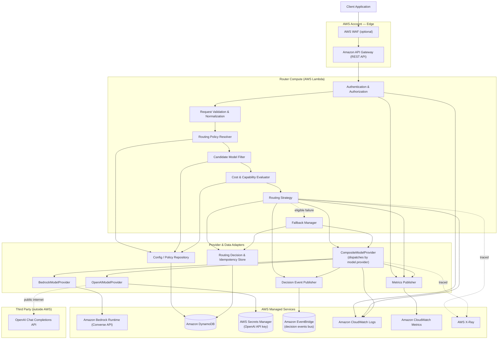
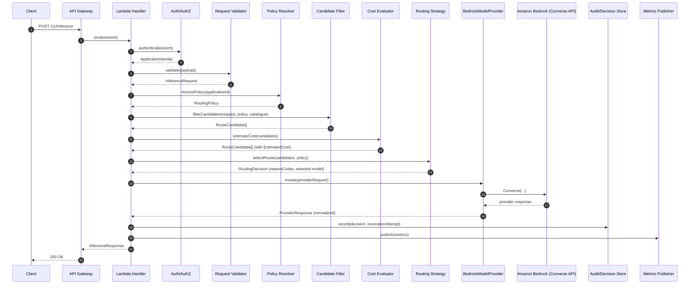
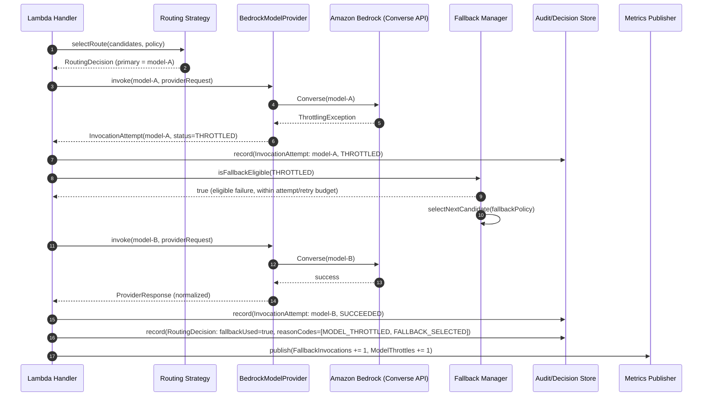
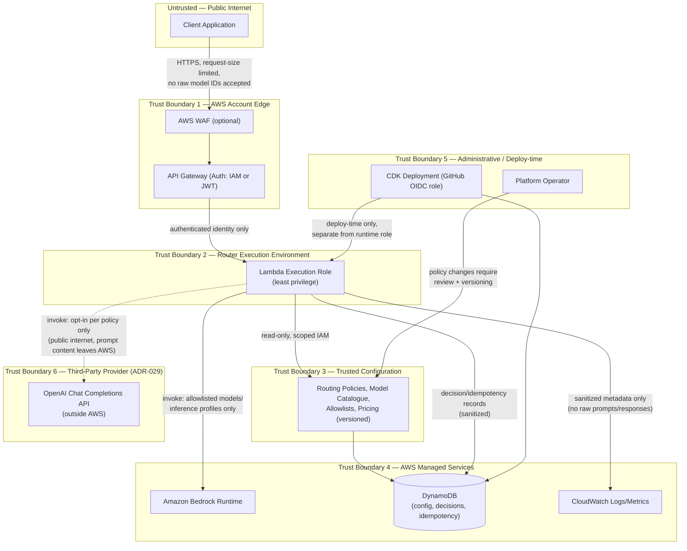

# Architecture Overview

## Purpose

`aws-model-router` is a serverless, policy-driven model routing platform. Applications
never call Amazon Bedrock (or any other model provider) directly — they send a normalized
inference request to the router, which resolves an application-specific routing policy,
filters and scores eligible models, invokes the selected model (with policy-controlled
fallback), and returns a normalized response together with an explainable routing
decision.

The router is the single enforcement point for which models an application may use, how
much it may spend, and what quality/latency guarantees apply — so that model choice,
cost control, and governance are platform concerns, not something re-implemented in every
application.

## Architectural layers

```
┌───────────────────────────────────────────────────────────────────────────┐
│ Handlers (src/handlers)                                                   │
│   Thin AWS Lambda entry points. Parse the event, call an application      │
│   service, map the result to an HTTP response. No business logic.         │
├───────────────────────────────────────────────────────────────────────────┤
│ Application (src/application)                                             │
│   Orchestrates the routing use case: validation → policy resolution →     │
│   candidate filtering → cost evaluation → strategy selection →            │
│   invocation → fallback → audit → metrics. Depends only on interfaces     │
│   (protocols) defined in the domain layer.                                │
├───────────────────────────────────────────────────────────────────────────┤
│ Domain (src/domain)                                                       │
│   Pure Python. Typed models (InferenceRequest, RoutingPolicy,             │
│   ModelDefinition, RoutingDecision, ...), routing strategies, reason      │
│   codes, cost/token estimation logic. No AWS SDK imports.                 │
├───────────────────────────────────────────────────────────────────────────┤
│ Adapters (src/adapters)                                                   │
│   Concrete implementations of domain/application interfaces against real │
│   infrastructure: BedrockModelProvider, OpenAIModelProvider (dispatched   │
│   between by CompositeModelProvider), DynamoDB-backed repositories,       │
│   CloudWatch metrics publisher, SSM/DynamoDB configuration loaders.       │
└───────────────────────────────────────────────────────────────────────────┘
```

Dependencies point inward: handlers depend on application, application depends on domain
interfaces, adapters implement domain/application interfaces. The domain layer has no
outward dependencies on AWS or any framework. This is what allows the entire routing
engine to be unit-tested without AWS credentials (Phase 2) and allows a second model
provider to be added later purely as a new adapter (ADR-002) — realized in Phase 10a
with `OpenAIModelProvider` (ADR-029).

## Components

* **API Gateway (REST API)** — the router's public entry point. Terminates
  authentication/authorization, applies request-size and throttling limits, and forwards
  to Lambda.
* **Authentication & authorization** — verifies caller identity (IAM or JWT — decision
  recorded in Phase 5) and resolves it to an `ApplicationIdentity`.
* **Request validation & normalization** — parses and validates the inbound payload into
  a typed `InferenceRequest`; rejects malformed input before any routing work occurs.
* **Routing Policy Resolver** — loads the effective `RoutingPolicy` for the calling
  application (application-specific policy, falling back to a default policy).
* **Candidate Model Filter** — filters the model catalogue down to models that match the
  requested capability, are on the application's allowlist, and satisfy token limits.
* **Cost & Capability Evaluator** — estimates input/output token counts and cost for each
  remaining candidate using versioned pricing configuration; excludes candidates that
  exceed the request's or policy's cost limit.
* **Routing Strategy** — selects the primary candidate using a deterministic strategy
  (preferred-model, lowest-estimated-cost, quality-tier, latency-preference, or weighted
  experiment — see `docs/adr/0007-deterministic-explainable-routing.md`).
* **Selected Model Adapter** — `CompositeModelProvider` (ADR-029) resolves the selected
  model's catalogued `provider` and dispatches to the matching concrete `ModelProvider`
  implementation — `BedrockModelProvider` or `OpenAIModelProvider` today — which maps the
  normalized request to that provider's specific call. Neither concrete adapter knows the
  other exists.
* **Amazon Bedrock Converse API** — the initial, AWS-native provider backend, invoked
  through Bedrock's provider-agnostic Converse API (ADR-009).
* **OpenAI Chat Completions API** — the second, non-AWS provider backend (ADR-029),
  reached over the public internet rather than within AWS's network (see
  `docs/security/threat-model.md`'s Boundary 6).
* **Fallback handling** — on an eligible failure, selects the next approved candidate per
  the application's fallback policy, bounded by a maximum attempt count.
* **Audit, metrics, events, and traces** — every decision and invocation attempt is
  recorded as sanitized metadata; operational metrics are published with low-cardinality
  dimensions; a sanitized decision event is published to EventBridge for external
  subscribers (ADR-030); AWS X-Ray and OpenTelemetry (ADR-031, exported only if an
  operator configures a real OTLP endpoint) both trace the request, independently.

## Component diagram



## Request sequence diagram



## Fallback sequence diagram



Note the non-fallback path: if the primary invocation instead failed with a
non-retryable error (e.g. a validation or policy-related failure surfaced at invocation
time), `FB.isFallbackEligible(...)` returns `false` and the handler returns an error
response directly — see `docs/adr/0007-deterministic-explainable-routing.md` and the
fallback-eligibility ADR added in Phase 4 for the full eligibility rules.

## Trust boundary diagram



Key trust decisions this diagram encodes:

* The client crosses exactly one authentication boundary (API Gateway) and never has a
  direct network path to Bedrock, DynamoDB, CloudWatch, or OpenAI.
* The Lambda execution role (runtime) is distinct from the CDK/GitHub OIDC deployment role
  (deploy-time); neither is a superset of the other by default.
* Routing configuration (policies, allowlists, pricing) is a separate trust boundary from
  request data — a compromised or malformed request cannot mutate policy, and policy
  changes are versioned and reviewed independently of request traffic.
* Telemetry crossing into CloudWatch is sanitized metadata, not raw request/response
  content — the observability boundary is intentionally lossy by design (ADR-008).
* Boundary 6 is the only one that leaves AWS entirely, and only when a policy explicitly
  allowlists an `openai`-provider model (ADR-029) — every other boundary crossing shown
  here stays within the AWS account. See `docs/security/threat-model.md`'s T23/T24.

## What this architecture explicitly avoids

* No EC2/ECS/EKS, no always-on containers, no NAT Gateway, no VPC for Lambda without a
  concrete private-network dependency.
* No opaque ML-based routing in the base implementation — every routing strategy is
  deterministic and produces enumerable reason codes.
* No client-supplied provider model IDs — only server-resolved logical capabilities.
* No default persistence of raw prompts or responses.

## Related documents

* [`docs/requirements.md`](../requirements.md) — functional and non-functional requirements
* [`docs/architecture/api-contracts.md`](api-contracts.md) — API request/response contracts
* [`docs/architecture/domain-glossary.md`](domain-glossary.md) — domain model glossary
* [`docs/adr/`](../adr/) — architecture decision records
* [`docs/architecture/final-review.md`](final-review.md) — Phase 9's verified
  end-to-end architecture review, known limitations, and future roadmap
* [`PROJECT_PLAN.md`](../../PROJECT_PLAN.md) — phased delivery plan
